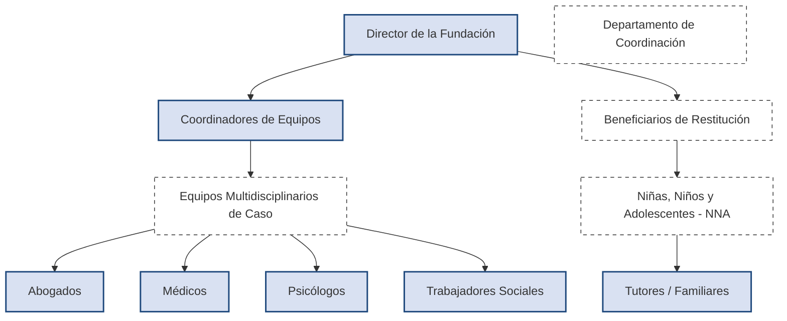
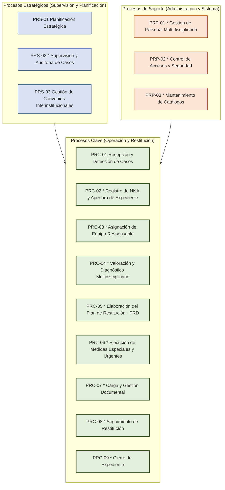

# Capítulo 2: Modelo del Alcance

En este capítulo se modela el alcance del sistema. Se presentan inicialmente los Actores involucrados y sus requerimientos, especificando cuáles se alcanzaron en la primera iteración y cuáles serán trabajados en la segunda iteración. Después se presentan los requerimientos funcionales de esta iteración y al final se presenta el modelo Físico y Lógico del sistema.

---

## 2.1. Contexto del proyecto

### 2.1.1. Descripción de la Organización (Fundación Futuro con Derechos)

La **Fundación Futuro con Derechos** es una organización no gubernamental dedicada a la protección, defensa y restitución integral de los derechos de Niñas, Niños y Adolescentes (NNA) en situación de vulnerabilidad o exclusión social. Su labor operativa se alinea estrechamente con lo mandatado por la Ley General de los Derechos de Niñas, Niños y Adolescentes (LGDNNA), y adopta metodologías de intervención interdisciplinarias para asegurar el principio del interés superior del menor.

El área operativa de la Fundación está integrada por una estructura multidisciplinaria de especialistas organizada bajo la dirección de un **Director** y gestionada de manera directa por **Coordinadores de Caso**. Estos profesionales colaboran activamente para diagnosticar la situación de derechos vulnerados, diseñar Planes de Restitución de Derechos (PRD) y coordinar la ejecución de medidas de protección especial y urgente con diversas dependencias del Estado.

El incremento exponencial de casos recibidos (más del doble en los últimos dos años) y la complejidad para coordinar a los diferentes profesionales que intervienen en un mismo expediente (abogados, médicos, psicólogos y trabajadores sociales) ha saturado la administración física tradicional. Las comunicaciones informales y la dispersión de documentos (como actas de nacimiento, cartillas médicas y dictámenes periciales) retrasan el seguimiento oportuno de los casos. 

Por esta razón, el sistema web **Taimotla** surge como la herramienta digital indispensable para centralizar el registro del personal multidisciplinario, agilizar la asignación de equipos de caso, estandarizar la carga de documentos de identidad y de salud de los menores, y monitorear en tiempo real el estatus de los expedientes.

---

### 2.1.2. Modelado de Usuarios

El sistema **Taimotla** se diseñará principalmente para el personal interno de la Fundación Futuro con Derechos. A continuación, se detalla la jerarquía organizacional del área operativa en forma de organigrama y se define el perfil de cada uno de los actores identificados en el sistema.

#### Organigrama de la Fundación (Estructura de Usuarios)

*Nota: Los elementos sombreados en azul representan a los usuarios activos que interactúan de manera directa con la interfaz del sistema Taimotla.*

---

#### Perfil y Definición de Actores

##### **Actor: Director de la Fundación**
* **Descripción:** Es la máxima autoridad administrativa y operativa de la organización. Supervisa el desempeño global, gestiona el catálogo de personal y aprueba la formación de los equipos de trabajo.
* **Responsabilidades:**
  * Registrar, actualizar, habilitar y deshabilitar las cuentas del personal multidisciplinario (coordinadores, abogados, médicos, psicólogos y trabajadores sociales).
  * Crear, modificar y disolver los equipos multidisciplinarios de trabajo.
  * Auditar periódicamente la carga de expedientes y supervisar el estatus general de los casos de restitución.
* **Perfil:**
  * Licenciatura terminada en Administración, Derecho o Ciencias Sociales.
  * Experiencia mínima de 3 años en dirección de organizaciones sociales o gubernamentales de protección de menores.
  * Habilidad en la toma de decisiones estratégicas, auditoría y gestión de personal.
* **Procesos en los que participa:**
  * **PRS-01** Planificación Estratégica de Restitución.
  * **PRP-01** Gestión de Personal Multidisciplinario.
  * **PRP-03** Mantenimiento de Catálogos.

##### **Actor: Coordinador de Caso**
* **Descripción:** Es el profesional encargado de liderar uno o varios equipos multidisciplinarios asignados a expedientes de NNA. Actúa como enlace entre el personal técnico y la dirección.
* **Responsabilidades:**
  * Supervisar las valoraciones individuales de cada especialista en su equipo.
  * Consolidar el Plan de Restitución de Derechos (PRD) y someterlo a revisión.
  * Gestionar y asignar actividades específicas del expediente al personal multidisciplinario.
  * Solicitar a la dirección la adición o remoción de integrantes de su equipo de acuerdo con las necesidades del caso.
* **Perfil:**
  * Licenciatura en Psicología, Derecho, Trabajo Social o afín, con especialización en derechos de la infancia.
  * Liderazgo, facilidad de palabra y capacidad para coordinar grupos multidisciplinarios.
* **Procesos en los que participa:**
  * **PRC-03** Asignación de Equipo Responsable.
  * **PRC-05** Elaboración del Plan de Restitución de Derechos (PRD).
  * **PRC-08** Seguimiento de Restitución.

##### **Actor: Abogado (Personal Multidisciplinario)**
* **Descripción:** Especialista legal responsable del análisis jurídico del caso del menor y de la promoción de recursos legales para garantizar sus derechos.
* **Responsabilidades:**
  * Realizar la valoración jurídica inicial del NNA y documentarla en el expediente.
  * Solicitar, tramitar y dar seguimiento a las medidas urgentes de protección ante el Ministerio Público y juzgados familiares.
  * Cargar y validar la documentación legal digital del NNA (actas de nacimiento, actas de detención, etc.).
* **Perfil:**
  * Licenciatura en Derecho con cédula profesional vigente.
  * Conocimiento sólido de la LGDNNA, procesos de lo familiar y derecho penal juvenil.
* **Procesos en los que participa:**
  * **PRC-04** Valoración y Diagnóstico Multidisciplinario.
  * **PRC-06** Ejecución de Medidas Especiales y Urgentes.
  * **PRC-07** Carga y Gestión Documental.

##### **Actor: Médico (Personal Multidisciplinario)**
* **Descripción:** Profesional de la salud encargado de evaluar el estado físico de las NNA, detectar afectaciones orgánicas y coordinar su atención en el sector salud.
* **Responsabilidades:**
  * Realizar valoraciones clínicas de ingreso y periódicas al menor.
  * Integrar el historial clínico físico y digital en el expediente único de Taimotla.
  * Gestionar la vinculación a instituciones de salud especializadas y verificar la vigencia de seguros médicos o cartillas de vacunación.
* **Perfil:**
  * Licenciatura en Medicina con cédula profesional vigente y deseable especialidad en Pediatría o salud infantil.
  * Sensibilidad en el trato con infantes víctimas de violencia.
* **Procesos en los que participa:**
  * **PRC-04** Valoración y Diagnóstico Multidisciplinario.
  * **PRC-06** Ejecución de Medidas Especiales y Urgentes.
  * **PRC-07** Carga y Gestión Documental.

##### **Actor: Psicólogo (Personal Multidisciplinario)**
* **Descripción:** Especialista en salud mental responsable del diagnóstico del estado psicológico del menor y de proveer contención emocional durante el proceso de restitución.
* **Responsabilidades:**
  * Aplicar baterías de pruebas y entrevistas para diagnosticar el grado de afectación emocional y grado de negación de NNA y sus tutores.
  * Redactar y adjuntar los dictámenes psicológicos periciales en el expediente digital.
  * Brindar sesiones de terapia psicológica y preparar al NNA antes de participar en diligencias ministeriales o judiciales.
* **Perfil:**
  * Licenciatura en Psicología con cédula profesional.
  * Enfoque terapéutico clínico infantil y capacitación en atención a trauma y abuso.
* **Procesos en los que participa:**
  * **PRC-04** Valoración y Diagnóstico Multidisciplinario.
  * **PRC-06** Ejecución de Medidas Especiales y Urgentes.

##### **Actor: Trabajador Social (Personal Multidisciplinario)**
* **Descripción:** Profesional encargado de investigar el entorno social, familiar y socioeconómico en el que se desenvuelve el menor para trazar su red de apoyo.
* **Responsabilidades:**
  * Realizar visitas domiciliarias y entrevistas a tutores y familiares de las NNA.
  * Elaborar los estudios socioeconómicos y reportes de entorno social.
  * Identificar e informar sobre el patrón de migración, nivel educativo, escolaridad y ocupación del tutor o familiar directo.
* **Perfil:**
  * Licenciatura en Trabajo Social con cédula profesional.
  * Capacidad de análisis de entornos vulnerables, empatía y técnicas de entrevista familiar.
* **Procesos en los que participa:**
  * **PRC-04** Valoración y Diagnóstico Multidisciplinario.
  * **PRC-08** Seguimiento de Restitución.

---

### 2.1.3. Procesos involucrados

Al digitalizar las operaciones de la Fundación mediante **Taimotla**, los procesos tradicionales se automatizarán y centralizarán. A continuación se define el mapa de procesos de la organización. Los procesos marcados con asterisco `(*)` y sombreados en gris en el mapa visual representan aquellos que son atendidos y mejorados de forma directa por la plataforma web.

#### Lista y descripción de procesos afectados por el sistema

* **PRS-02 * Supervisión y Auditoría de Casos:** Monitoreo del estado y avance de los expedientes por parte del Director de la Fundación para garantizar el apego a los plazos legales del artículo 123 de la LGDNNA.
* **PRC-02 * Registro de NNA y Apertura de Expediente:** Alta del menor en la base de datos centralizada del sistema, capturando su CURP, nacionalidad, etnia, datos de contacto e identidad básica.
* **PRC-03 * Asignación de Equipo Responsable:** Formación de un equipo de trabajo (compuesto por un coordinador y entre 2 y 4 especialistas multidisciplinarios) para encargarse de forma exclusiva de la atención del expediente del NNA.
* **PRC-04 * Valoración y Diagnóstico Multidisciplinario:** Registro digital de los diagnósticos iniciales del menor en materia clínica, psicológica, socio-familiar y jurídica.
* **PRC-05 * Elaboración del Plan de Restitución de Derechos (PRD):** Registro y estructuración de los derechos vulnerados detectados (educación, salud, identidad) y las medidas recomendadas bajo el principio del interés superior del menor.
* **PRC-06 * Ejecución de Medidas Especiales y Urgentes:** Control de las solicitudes y estatus de ejecución de medidas de protección (ej. acogimiento residencial, terapia de contención, cirugías, trámites legales).
* **PRC-07 * Carga y Gestión Documental:** Carga digitalizada al servidor del sistema de los documentos comprobatorios obligatorios del menor (acta de nacimiento, cartilla de vacunación, CURP, etc.) con sus metadatos y vigencias.
* **PRC-08 * Seguimiento de Restitución:** Consultas periódicas sobre la restitución de cada uno de los derechos del NNA.
* **PRC-09 * Cierre de Expediente:** Archivo histórico y conclusión del caso tras validar que todos los derechos de la NNA han sido plenamente garantizados.
* **PRP-01 * Gestión de Personal Multidisciplinario:** Registro, edición de perfil, desactivación (deshabilitado) y reactivación (habilitado) de las credenciales de los empleados del sistema.
* **PRP-02 * Control de Accesos y Seguridad:** Control de sesiones de usuario (Director, Coordinadores y personal) con contraseñas seguras y restricciones de rol.
* **PRP-03 * Mantenimiento de Catálogos:** Actualización en la base de datos de catálogos paramétricos requeridos por el sistema (tales como sexos, etnias, nacionalidades, tipos de documentos, parentescos, etc.).
